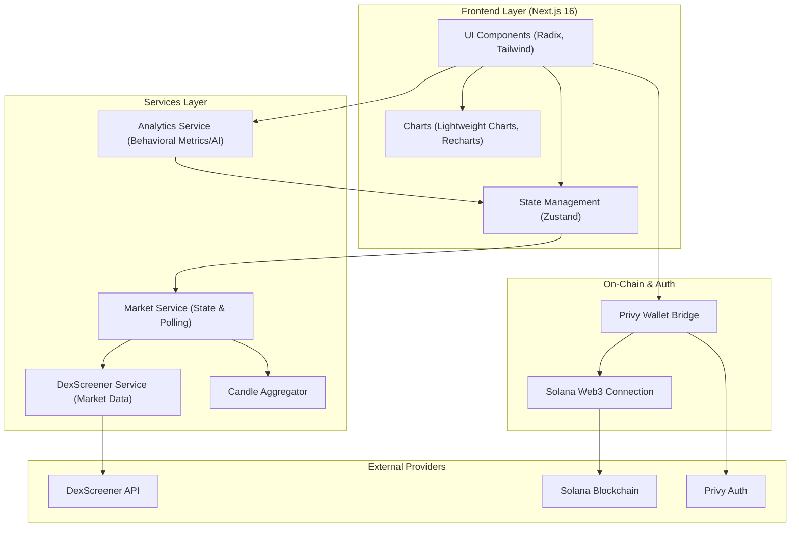

# Dominus Quant (DQuant)

Dominus Quant is a narrative-driven, AI-assisted crypto trading platform designed for real-time market insight and optional automated spot execution. Built as a personal project, it’s a proof-of-concept for **next-generation quant infrastructure**, combining behavioral analytics, distributed intelligence, and portfolio storytelling.

This project demonstrates what’s possible when **trading intelligence, narrative detection, and modular infrastructure** meet.

---

## 📸 Platform Screenshots

### Dashboard Overview

### Market Analysis Interface

### Trade Execution Panel

### Portfolio Analytics

### Behavioral Insights Engine

### Trade Journal

### Performance Metrics

### AI Confidence Scoring

### Automated Pool Mode

### Mobile / Responsive View

---

## Why DQuant Matters

Markets move on **narratives**, not just price.

Dominus Quant tracks:

- Ecosystem signals — tweets, hackathons, announcements  
- Market microstructure — liquidity shifts, volume spikes  
- Behavioral patterns — FOMO cycles, performance decay  

By combining these layers, DQuant gives traders actionable intelligence and provides automated pool participants a risk-managed execution engine.

---

## Core Product Features

### 1. Hybrid Trading Platform
- **Manual Mode:** Traders receive signals + confidence scores  
- **Automated Pool Mode:** Allocate capital and let the engine execute with guardrails  

### 2. Narrative Portfolio Analytics
- Converts trade data into story-driven insights  
- Identifies performance peaks and mistakes  
- AI-driven behavioral correction  

### 3. Deep AI Insights
- Execution timing analysis  
- Revenge trade detection  
- Overtrading warnings  
- Probabilistic trade scoring  

### 4. Trading Journal & Dashboard
- Automatic trade indexing  
- Visual trade replay  
- Key metrics: PnL, win rate, bias, session performance  

---

## System Architecture

---

Tech Stack

Frontend: Next.js 16, Tailwind CSS, Zustand

Charts: Lightweight Charts, Recharts

On-Chain: Solana Web3.js

Auth: Privy

AI Layer: Real-time behavioral analysis

Architecture: Modular, distributed-ready

---

Roadmap

Expand distributed signal layer

Add multi-chain support

Enhance AI behavioral modeling

Launch community-governed quant pool

---

Getting Started

git clone https://github.com/yourusername/dominus-quant.git
cd dominus-quant
npm install
npm run dev

---

License

MIT — open for experimentation and research.
